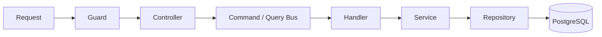

# Awesome NestJS Boilerplate v11

[](LICENSE)
[](https://nestjs.com)
[](https://nodejs.org)
[](https://github.com/NarHakobyan/awesome-nest-boilerplate/actions)

> A minimal, enterprise-pattern NestJS starter built for teams that care about code
> structure at scale. Ships with CQRS, strict TypeScript, and JWT auth (RS256) —
> all wired with zero configuration drift.

## Quick Start

```bash
# 1. Clone
npx degit NarHakobyan/awesome-nest-boilerplate my-nest-app
cd my-nest-app

# 2. Configure
cp .env.example .env
# Set DB_HOST, DB_PORT, DB_USERNAME, DB_PASSWORD, DB_DATABASE
# Paste your JWT_PRIVATE_KEY and JWT_PUBLIC_KEY (see .env.example for examples)

# 3. Install & run
pnpm install
pnpm start:dev
```

Open [http://localhost:3000](http://localhost:3000). The API docs are at [/documentation](http://localhost:3000/documentation).

> Prefer a database out of the box? `docker-compose up -d postgres` first.

## What's Inside

| | | |
|---|---|---|
| **CQRS** — Commands, queries, handlers | **JWT Auth (RS256)** — Login, register, RBAC | **TypeORM + PostgreSQL** — Entities, migrations |
| **Strict TypeScript** — No `any`, ESM, verbatim modules | **i18n** — Multi-language (en_US, ar_SA) | **Swagger** — Auto-generated API docs |
| **Vite HMR** — Instant dev reload | **UUID v7** — Time-sortable primary keys | **Biome + ESLint** — Linting & formatting |
| **Helmet + Rate Limiting** — Built-in security | **CORS** — Configurable origins | **Validation** — Custom decorators, DTO guards |

## Taste of the Codebase

A typical CQRS flow — command, handler, and service wired through NestJS DI:

```ts
// ── Command ──────────────────────────────────────────────
export class CreateSettingsCommand extends Command {
  constructor(
    public readonly userId: Uuid,
    public readonly dto: CreateSettingsDto,
  ) {
    super();
  }
}

// ── Handler ──────────────────────────────────────────────
@CommandHandler(CreateSettingsCommand)
export class CreateSettingsHandler {
  constructor(
    @InjectRepository(UserSettingsEntity)
    private repo: Repository<UserSettingsEntity>,
  ) {}

  async execute({ userId, dto }: CreateSettingsCommand): Promise<UserSettingsEntity> {
    return this.repo.save(this.repo.create({ ...dto, userId }));
  }
}

// ── Service ──────────────────────────────────────────────
@Injectable()
export class UserService {
  constructor(private commandBus: CommandBus) {}

  @Transactional()
  createSettings(userId: Uuid, dto: CreateSettingsDto): Promise<UserSettingsEntity> {
    return this.commandBus.execute(new CreateSettingsCommand(userId, dto));
  }
}
```

## Architecture



Every feature module follows this structure:

```
src/
├── common/              # Shared DTOs, base entity
├── constants/           # Enums, role types
├── database/            # Migrations, TypeORM config
├── decorators/          # @AuthUser, @UUIDParam, @UseDto
├── filters/             # Global exception filters
├── guards/              # Auth guards (JWT, roles)
├── i18n/                # Translation files (en_US, ar_SA)
├── interceptors/        # Language, translation interceptors
├── modules/
│   ├── auth/            # JWT auth (RS256), login/register
│   ├── user/            # User CRUD, RBAC
│   └── health-checker/  # Health check endpoint
├── shared/              # Global services, config
└── validators/          # Custom validation decorators
```

[Full architecture →](https://narhakobyan.github.io/awesome-nest-boilerplate/architecture.html)

## Environment Variables

Copy `.env.example` → `.env`. Most variables come pre-configured with working defaults. You only need to change these:

| Variable | What to set |
|---|---|
| `DB_HOST`, `DB_PORT`, `DB_USERNAME`, `DB_PASSWORD`, `DB_DATABASE` | PostgreSQL connection (or use `docker-compose up -d postgres` — defaults match) |
| `JWT_PRIVATE_KEY` | RS256 private key — generate your own or use the example PEM in `.env.example` |
| `JWT_PUBLIC_KEY` | RS256 public key — matching public key |

Every other variable in `.env.example` has a working default for local development.

[All environment variables →](https://narhakobyan.github.io/awesome-nest-boilerplate/development.html)

## Making It Your Own

1. **Rename the project** — update `name` in `package.json`
2. **Update `.env`** — replace the JWT keys and DB credentials with your own
3. **Customize this README** — replace it with your project's docs

## Documentation

1. [Architecture](https://narhakobyan.github.io/awesome-nest-boilerplate/architecture.html) — CQRS, repository pattern, DI, entity-DTO mapping
2. [Setup & Development](https://narhakobyan.github.io/awesome-nest-boilerplate/development.html) — first-time setup, scripts, debugging
3. [Code Generation](https://narhakobyan.github.io/awesome-nest-boilerplate/code-generation.html) — NestJS schematics for scaffolding
4. [Naming Cheatsheet](https://narhakobyan.github.io/awesome-nest-boilerplate/naming-cheatsheet.html) — file, class, and variable conventions
5. [Linting](https://narhakobyan.github.io/awesome-nest-boilerplate/linting.html) — Biome + ESLint setup
6. [OpenAPI MCP](https://narhakobyan.github.io/awesome-nest-boilerplate/openapi-mcp.html) — AI assistants calling your API

## Community

[Discuss on GitHub →](https://github.com/NarHakobyan/awesome-nest-boilerplate/discussions)

---

Sponsored by [M One](https://moneteam.com) & [HR Drone](https://hrdrone.am)
